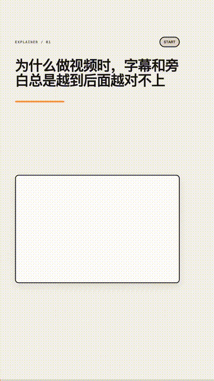
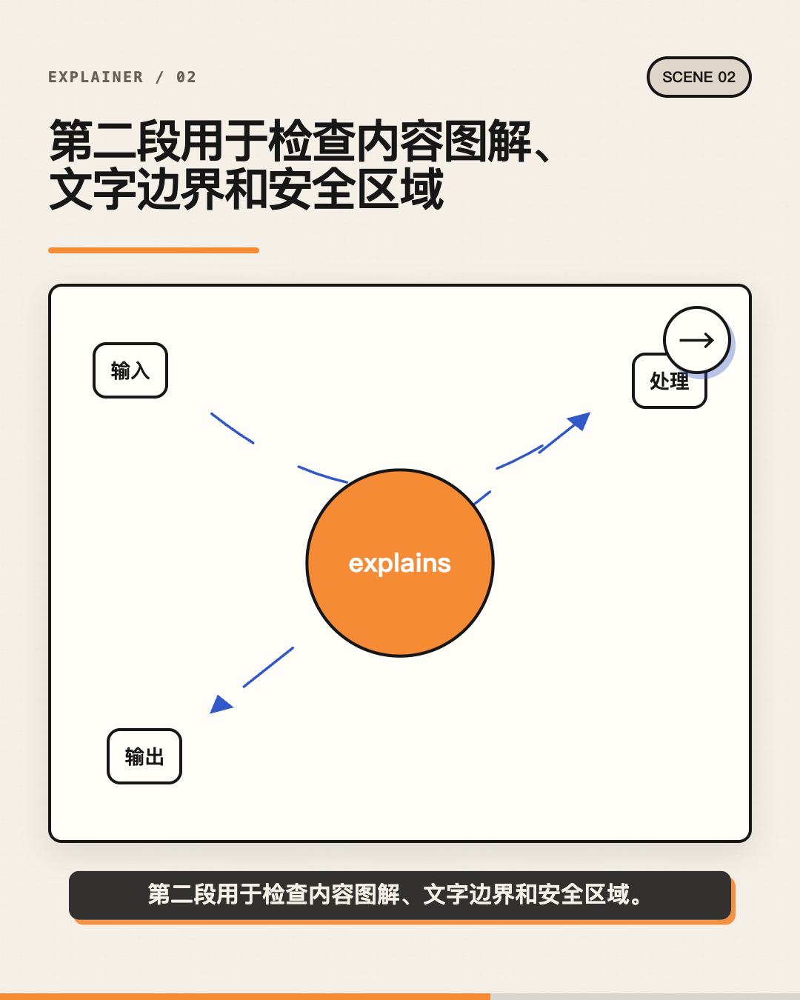
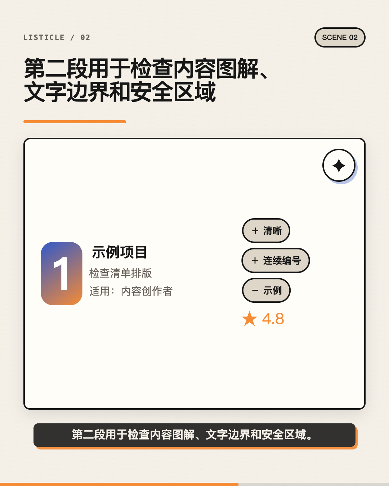
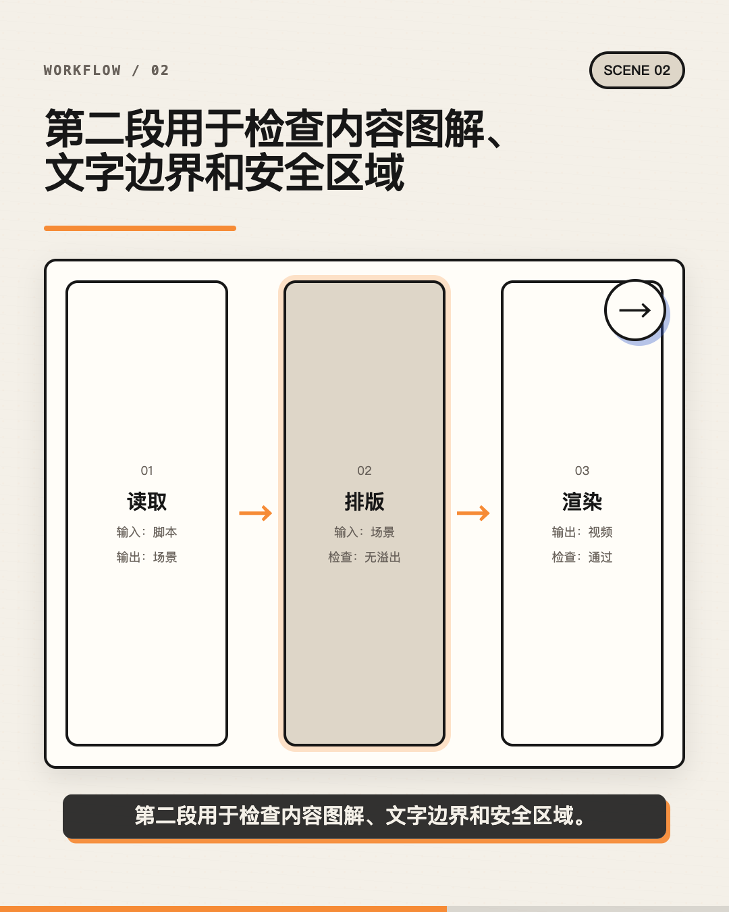
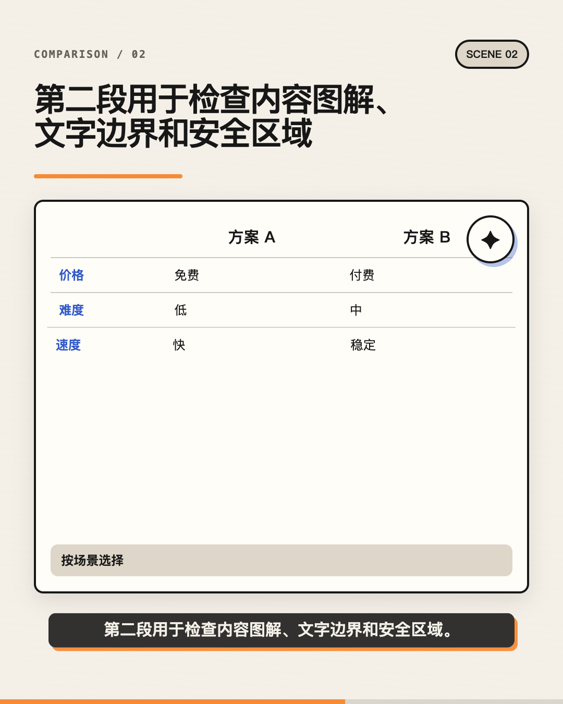
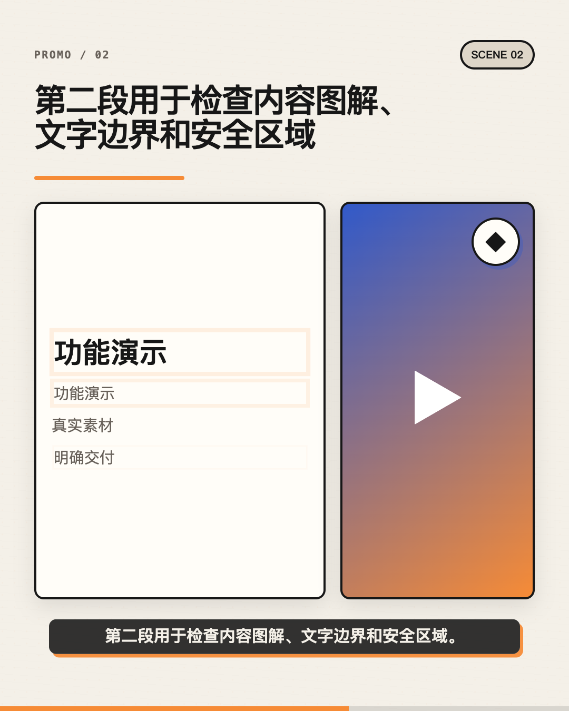
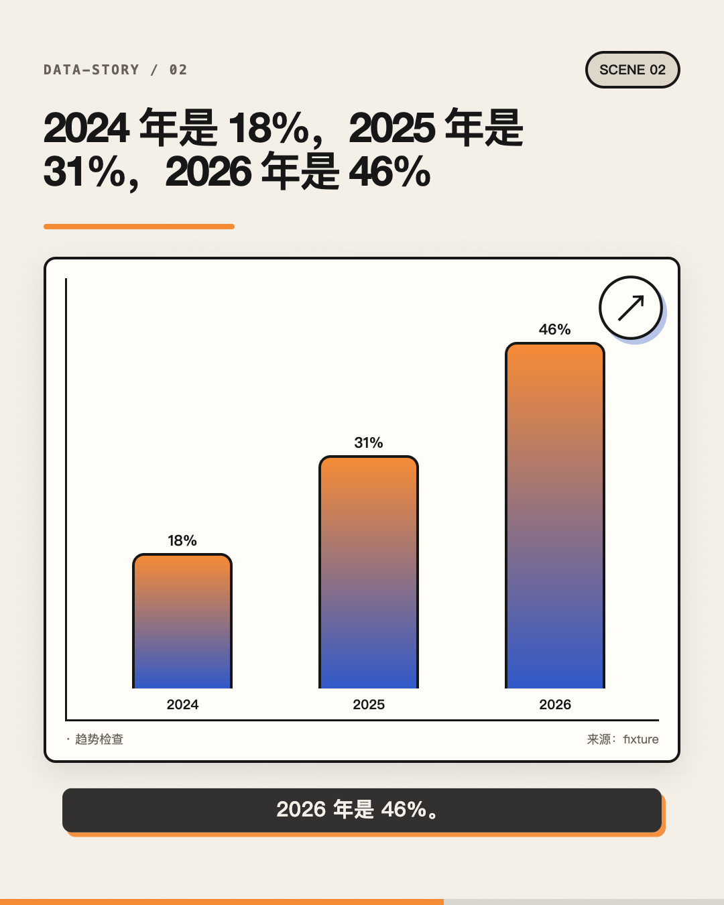

<h1 align="center">Video Workflow for Codex｜一句话生成完整视频</h1>

<p align="center"><strong>一句需求输入，输出有来源、全同步、适配平台的视频成片；默认生产链完全免费、本地运行。</strong></p>

<p align="center">中文 · <a href="README.md">English</a></p>

**一句话 → 文案 → 配音 → 逐字一致的字幕 → 动画 → 横版、竖版和 4:5 成片。**

<p align="center">
  <a href="examples/public-demo/output/final.mp4"></a>
</p>

<p align="center"><a href="examples/public-demo/output/final.mp4">播放 17 秒 MP4</a> · <a href="examples/public-demo">查看可复现交付包</a></p>

这个 Codex 社区插件可以从一句需求、确认后的逐字稿、结构化内容计划或 CSV/JSON 数据继续完成一套经过验证的完整视频交付。

默认路径不需要媒体 API Key、付费配音、生图账号、HyperFrames 或 Remotion。

完整流程：

```text
一句需求 / 锁定逐字稿 / CSV / JSON / 本地素材
  → 判断内容类型并给出置信度，可识别混合类型
  → 六类内容使用六套结构化视觉语法
  → 语义视觉导演：主体、关系、隐喻、运动和镜头
  → 连续场景免费配音和发音词典
  → 旁白驱动 cue、词级时间、字幕和内容动画
  → 语义音效、可选本地音乐和自动压低背景音
  → 横版、竖版、4:5 按平台重新排版
  → 三套独立封面构图并自动评分选优
  → 事实、音频、时序、视觉和审美质检
  → MP4 + 封面 + SRT/VTT + 可编辑故事板 + 核查报告
```

## 只说一句话

安装后，新建一个 Codex 任务，直接说：

```text
使用 $video-workflow，做一个讲 MCP 的竖版白板科普视频。
```

需要时，Codex 会先写出完整脚本并锁定，然后选择内容结构、尺寸、平台安全区、主题和语言，再运行确定性的本地生产流程。只有会明显改变事实、身份或结果的歧义才需要确认。

## 1.1 不再只是文字卡片和入场动画

每个场景都会锁定一份视觉导演计划，明确焦点、主体与关系、视觉隐喻、语义运动、镜头意图和构图占比。机制会组装和变化，流程会沿路径推进，图表按真实数值生长，对比从两侧进入，循环会真正表现回到起点。

声音默认按整场连续合成，减少句子拼接感；还支持用户选择的本地配音适配器、语义提示音，以及 `full` 模式下完全本地生成的背景氛围。封面会单独生成三种构图再检查碰撞与占比。故事板编辑器可以只改画面并只让受影响的场景失效重渲染。

| 类型 | 专属结构和正确性规则 |
| --- | --- |
| `explainer` | 定义、机制、因果、时间线、结构、类比、误区和循环 |
| `listicle` | 跨场景连续编号、图标/素材、理由、适用人群、优缺点和评分 |
| `workflow` | 输入 → 操作 → 输出 → 检查，并支持分支、前置条件、用时、注意事项、演示和验收 |
| `comparison` | 统一维度对比表、Before/After、权衡、雷达图、判断和结论 |
| `promo` | 痛点 → 方案 → 演示 → 有来源的证据 → CTA；不编造数据或评价 |
| `data-story` | CSV/JSON、坐标、单位、来源、时间范围、排序、比例尺、缺失值、标注和旁白数值校验 |

自动分类现在会输出置信度和可选的第二类型。普通四段科普不会再因为段落多就被判成清单，“产品用户增长 30%”也会优先识别为数据内容。

### 六种视觉系统，不是一套卡片换六种颜色

下面六张图使用相同的 `social` 画幅和 `editorial` 主题，结构差异只来自内容类型。72 张截图回归负责检查溢出和布局安全；这些精选图则单独展示视觉质量边界。

<table>
  <tr>
    <td><strong>科普解释</strong><br></td>
    <td><strong>清单盘点</strong><br></td>
  </tr>
  <tr>
    <td><strong>教程流程</strong><br></td>
    <td><strong>统一维度对比</strong><br></td>
  </tr>
  <tr>
    <td><strong>产品宣传</strong><br></td>
    <td><strong>数据故事</strong><br></td>
  </tr>
</table>

## 完全免费、本地核心

- **配音：**连续使用 macOS `say`、Windows `System.Speech`、Linux 免费 `espeak-ng`；也可通过明确的本地可执行适配器接入其他本地语音引擎。
- **画面：**响应式 HTML/CSS/SVG 图解、排版、本地图片/SVG/视频/截图和 GSAP 动画。
- **音视频：**锁定版本的 FFmpeg、ffprobe，加电脑已有的 Chrome/Chromium/Edge。
- **账号：**不需要媒体 API、云配音、生图账号或外部渲染服务。
- **隐私：**默认路径不会把文案、声音或本地素材发到云端媒体接口。

可以使用自己有权使用的音频和素材。除上面的通用公开案例外，仓库不包含私人音色、人物照片、个人风格说明、密钥、个人成片或模型权重。

## 尺寸、平台、主题和语言

- 横版 `landscape`：1920×1080
- 竖版 `portrait`：1080×1920
- 4:5 `social`：1080×1350

平台预设包括 `douyin`、`reels`、`shorts`、`xiaohongshu` 和 `generic`，内容安全区与封面安全区分别处理。同一条通过校验的时间线可以同时输出三种尺寸，而且会重新排版，不是压缩同一画面。

`whiteboard`、`editorial`、`tech`、`product` 四套主题分别定义字体、图标、边框、纹理、转场、动效、字幕和音乐倾向。

语言可以自动判断，也可以通过 `--language` 指定；同时支持多语言字体、系统音色选择、不同语言字幕断句，以及缩写、公式、人名和数字发音词典。

## 正确性和质检

- 旁白、画面字幕、SRT、VTT 必须完整还原同一份锁定文案。
- 场景时长来自真实音频，动画必须在对应口播结束前完成。
- 逐句动态均衡，最终混音目标约 -16 LUFS、峰值约 -1.5 dBTP。
- 语义提示音本地生成；`full` 声音模式还会生成背景氛围，并在人声出现时自动压低。
- 真数据图必须有有限数值和来源；否则只能明确标注为趋势示意。
- 数据场景里说出的数字必须存在于图表标签或数值中。
- 对比必须有两个对象和同一组维度。
- 推广里的指标、评价和能力声明必须已核实并关联来源。
- 自动检查路径、素材缺失、文字溢出、平台安全区、对比度、构图占比、重复信息、封面/主体/字幕碰撞、cue 顺序、空白、响度、峰值、黑帧和成片时长。
- 视觉回归覆盖 6 类型 × 3 画幅 × 4 主题，共 72 种组合。

## 安装

环境：Node.js 22.12+、Chrome/Chromium/Edge、macOS/Windows/Linux；Linux 一键配音需安装 `espeak-ng`。

```bash
codex plugin marketplace add swping999/video-workflow-for-codex --ref main
codex plugin add video-workflow@swping999-video
```

安装后新建 Codex 任务，让 Skill 重新载入。

## 一键生成

```bash
(cd plugins/video-workflow/runtime && npm ci)

PLUGIN=plugins/video-workflow
$PLUGIN/scripts/video-workflow build \
  --brief "解释为什么字幕会逐渐不同步" \
  --script examples/public-demo/script.txt \
  --plan examples/public-demo/content-plan.json \
  --output /tmp/video-workflow-demo \
  --slug video-workflow-demo \
  --type auto \
  --format portrait \
  --formats landscape,portrait,social \
  --platform douyin \
  --theme editorial \
  --sound-design subtle \
  --language auto \
  --quality high
```

数据视频可以增加 `--data /绝对路径/data.csv`，品牌配置可以增加 `--brand /绝对路径/brand.json`。结构化字段见[内容计划参考](plugins/video-workflow/skills/video-workflow/references/content-plan.md)。

仓库内的[公开案例](examples/public-demo)包含需求、锁定逐字稿、内容计划、最终 MP4、封面、逐字一致的 SRT/VTT、故事板 JSON 和事实核查报告。示例使用免费的系统配音，不含私人声音、人物或私有素材。

## 自定义配音、版本修改和局部重渲染

```bash
# 自己有权使用的配音
video-workflow create ...
video-workflow export --project /绝对路径/project
# 优先按场景 ID 把连续音频放进 .media/raw-scenes/；
# 仍兼容按 cue ID 放进 .media/raw-cues/。
video-workflow synthesize --project /绝对路径/project --provider files
video-workflow process-audio --project /绝对路径/project
video-workflow verify --project /绝对路径/project

# 修改文案时先把旧版本归档到 revisions/
video-workflow revise --project /绝对路径/project --script /绝对路径/revised-script.txt

# 只预览或重渲染第 2、4 个场景，其余场景复用缓存
video-workflow storyboard --project /绝对路径/project
video-workflow apply-storyboard --project /绝对路径/project --patch /绝对路径/storyboard.patch.json
video-workflow preview --project /绝对路径/project --scenes 2,4
video-workflow render --project /绝对路径/project --scenes 2,4 --formats landscape,portrait,social
video-workflow cache-info --project /绝对路径/project
video-workflow clean-cache --project /绝对路径/project
```

## 交付文件

| 文件 | 用途 |
| --- | --- |
| `script.locked.txt` | 旁白与字幕唯一逐字稿 |
| `content-plan.locked.json` | 结构化画面、数据、来源、声明、品牌和素材 |
| `direction-plan.locked.json` / `sound-plan.locked.json` / `cover-plan.locked.json` | 可复现的视觉导演、声音和封面决策 |
| `story-source.json` | 带哈希的工程源数据 |
| `assets/audio-master.wav` | 人声加可选音乐/音效的最终标准化混音 |
| `assets/voice-manifest.json` | cue、主音轨和混音的哈希、时长、响度、峰值 |
| `deliverables/captions.srt` / `.vtt` | 同源字幕 |
| `deliverables/word-timestamps.json` | 提供或估算的词级时间 |
| `deliverables/storyboard.html` / `storyboard-editor.html` / `.json` | 预览、画面编辑与机器可读故事板 |
| `deliverables/aesthetic-report.json` / `cover-report.json` | 关键帧和封面构图质检 |
| `deliverables/fact-check.md` / `.json` | 来源、声明和图表核查 |
| `renders/cover-<format>-1..3.png` / `cover-<format>.png` | 三套候选和自动选出的平台安全区封面 |
| `renders/final-<format>.mp4` | 各尺寸成片 |
| `renders/final.mp4` | 主尺寸兼容输出 |

## 仓库验证

```bash
npm run check          # 单元、音频冒烟、隐私检查
npm run check:full     # 再加成片冒烟和 72 组合视觉回归
```

这是为 Codex 制作的独立社区插件，不是 OpenAI 官方插件，也不是新训练的文生视频模型。更多说明见[安全政策](SECURITY.md)、[贡献指南](CONTRIBUTING.md)、[第三方声明](THIRD_PARTY_NOTICES.md)和[质检交付参考](plugins/video-workflow/skills/video-workflow/references/quality-and-delivery.md)。

代码使用 MIT License，运行依赖保留各自许可证。
